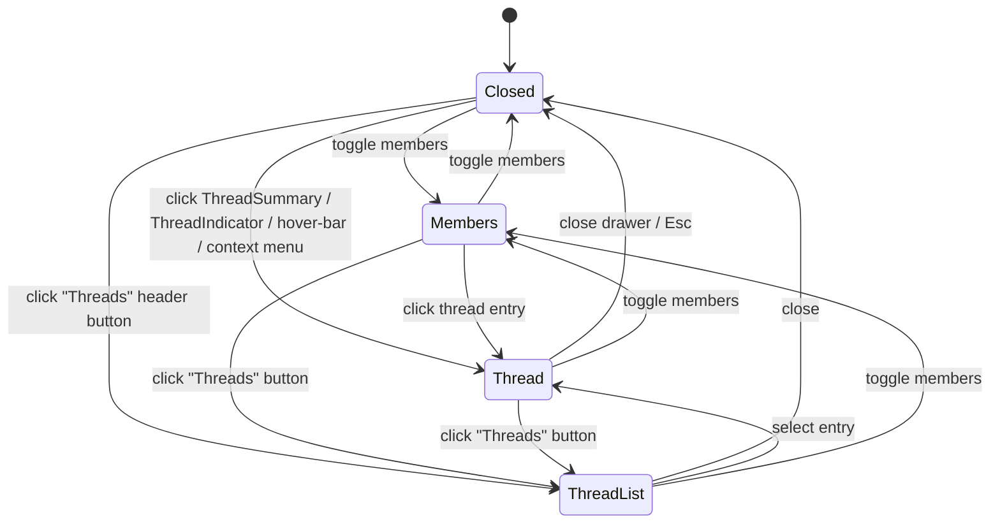

# feat: Visual Threads Support for Cinny

## Overview

Add Element-style visual thread support to cinny: a right-panel **thread drawer**, a **"X replies"** affordance on thread roots, a per-room **threads list**, thread-aware **read receipts and unread state**, and the **`threadSupport: true`** SDK flag that activates `matrix-js-sdk`'s `Thread` model.

The work targets the personal-fork branch on cinny's existing `matrix-js-sdk` (38.2.0) — not the upstream in-house SDK migration. The implementation leans heavily on element-web's patterns (`ThreadView`, `ThreadSummary`, `ThreadPanel`, `useRoomThreadNotifications`) since they're a known-good reference against the same SDK family.

The first two units are de-risking spikes that gate the rest of the plan.

## Problem Frame

Cinny renders threaded replies inline with a `ThreadIndicator` chip but provides no way to read a thread as a unit, no signal on the root that replies exist, and no thread-aware unread state. Compared to Element, threads are effectively invisible. (See origin: `docs/brainstorms/threads-support-requirements.md` — note the doc itself flags the user-pain claim as thinly evidenced and acceptable as personal-utility.)

## Requirements Trace

Plan satisfies R1–R15 from origin. Mapping:

- R1 (drawer entry points) → Units 5, 8
- R2 (drawer reuses RoomInput) → Unit 6
- R3 (CSS responsive, narrow takeover) → Units 4, 12
- R4 (drawer + members mutually exclusive) → Unit 4
- R5 (close restores scroll/follow) → Unit 5
- R6 (ThreadSummary affordance) → Unit 7
- R7 (per-room threads list) → Unit 11
- R8 (timeline filter, P2) → Unit 13 — only if not descoped (see Open Questions)
- R9 (send via existing E2EE paths) → Units 6, 9
- R10 (receive via existing decryption pipeline) → Units 5, 9
- R11 (atom hygiene — metadata only) → Units 5, 9
- R12 (thread-scoped read receipts/unread) → Unit 10
- R13 (no UX gating on encryption) → enforced across plan; no separate unit
- R14 (`threadSupport: true` at init) → Unit 3
- R15 (edge cases) → Unit 9

## Scope Boundaries

- Not building a global cross-room threads inbox (Element's `ThreadsActivityCentre`)
- Not building notification-rule UI for participated-threads-only
- Not gating threads on encryption state
- Not introducing URL-based deep-linking to threads (atom state only)
- Not bootstrapping a test framework — cinny ships without one and that does not change here (verification is manual; see "Verification posture" under Key Technical Decisions)
- Not landing upstream

### Deferred to Separate Tasks

- Permalink/share-link routing for threads — separate plan, blocked on upstream router conventions
- Full A11y polish (Tab order audit, screen-reader copy review) — separate plan
- Notification-rule settings UI for "notify only on participated threads" — separate plan, related to PR #2586

## Context & Research

### Relevant Code and Patterns

- `src/client/initMatrix.ts:14-41` — `createClient()` call site; add `threadSupport: true`
- `src/app/features/room/Room.tsx:48-85` — current right-side slot, single occupant `MembersDrawer` gated by `isPeopleDrawer` setting and `ScreenSize.Desktop`
- `src/app/features/room/MembersDrawer.tsx` — pattern to mirror for `ThreadDrawer`
- `src/app/features/room/RoomTimeline.tsx:155–225, 956–983, 1020–1150` — timeline-set iteration, `startThread` send path, message renderer, threadRootId rendering
- `src/app/features/room/RoomInput.tsx:363–375` — existing thread-aware send path (m.thread relation already wired)
- `src/app/features/room/message/Message.tsx:875, 941–950, 1031–1050` — `isThreadedMessage` gate, hover-bar `ThreadPlus` button, "Reply in Thread" context menu item
- `src/app/components/message/Reply.tsx:58–106` — existing `ThreadIndicator` chip rendering
- `src/app/state/room/roomInputDrafts.ts:23–57` — `roomIdToMsgDraftAtomFamily`, `roomIdToReplyDraftAtomFamily`, `IReplyDraft` shape (grandfathered for room input; thread input must follow R11 atom hygiene)
- `src/app/utils/notifications.ts` — `markAsRead(mx, roomId, hideActivity)` and `sendReadReceipt` invocation (currently not thread-aware)
- `src/app/state/settings.ts:30, 64` — `isPeopleDrawer` setting; pattern for new `isThreadDrawer` toggle if needed
- `src/app/features/room/RoomViewHeader.tsx` — header where the "Threads" button mounts (already crowded; see decisions)
- `src/app/pages/client/inbox/Notifications.tsx:459, 535` — notification renderer that already handles `threadRootId`; needs to dispatch open-thread on click

### Institutional Learnings

- `docs/solutions/` does not exist in this repo. No prior cinny learnings to leverage.

### External References

- **element-web (reference impl):**
  - `apps/web/src/MatrixClientPeg.ts:299` — `opts.threadSupport = true` passed to `createClient()`
  - `apps/web/src/components/views/rooms/ThreadSummary.tsx` — pattern for R6 affordance: `useTypedEventEmitterState(thread, ThreadEvent.Update, () => thread.length)`, return null at zero, `lastReply.isDecryptionFailure()` fallback, unread indicator via `useUnreadNotifications(thread.room, thread.id)`
  - `apps/web/src/components/structures/ThreadView.tsx` — drawer renders inside `BaseCard`, reuses `MessageComposer`, `Measured`/`narrow` for responsive
  - `apps/web/src/components/structures/ThreadPanel.tsx` — per-room threads list pattern
  - `apps/web/src/hooks/room/useRoomThreadNotifications.ts` — full pattern for R12: reads `room.threadsAggregateNotificationType`, falls back to `doesRoomHaveUnreadThreads(room)`, listens to `ThreadEvent.New`/`Update` plus `RoomEvent.UnreadNotifications`/`Receipt`/`Timeline`/`Redaction`/`LocalEchoUpdated`/`MyMembership`
  - `apps/web/src/dispatcher/payloads/ShowThreadPayload.ts` — dispatcher payload pattern; cinny uses Jotai atoms instead but the shape (`rootEvent`, `push`) translates
- **cinny PR #2787** (`feat: Threads UI drawer`, closed as duplicate of #2492) — `ThreadDrawer.tsx` (724 LOC), `ThreadBrowser.tsx` (372 LOC), `roomToOpenThread`/`roomToThreadBrowser` atoms. Audit gates whether we forward-port (Unit 1).

## Key Technical Decisions

- **Generalize the right-panel slot.** Today `Room.tsx:76-81` has a single hard-coded `MembersDrawer`. Replace with a "right-panel phase" pattern: one Jotai atom `roomRightPanelAtomFamily(roomId)` with a discriminated union (`'members' | { phase: 'thread', rootEventId } | 'thread-list' | null`). Members toggle, drawer open, threads list open all set this atom. Mutually exclusive by construction.
- **Atom-based open-thread state, not URL routing.** Matches element-web's dispatcher model (atom is cinny's equivalent). Avoids reworking `react-router` paths and the `BackRouteHandler`. Trade-off: no thread permalinks for v1 (acknowledged scope boundary).
- **Reuse `RoomInput` parameterized with thread context.** Avoids forking a second composer. The thread reply-draft atom uses a new family keyed by `roomId + threadRootId` and stores only the reply event ID + relation, NOT the body string (R11 atom hygiene). Body content rendered at draft time is re-derived from the live `MatrixEvent`.
- **`threadSupport: true` is a P0 ship-blocker, not a planning detail.** Without it, R6 (`thread.length`), R7, R12 cannot be implemented. The smoke test in Unit 2 verifies the existing `RoomTimeline.tsx` rendering survives the flag flip.
- **Verification posture: manual.** Cinny has no test infrastructure (`*.test.ts*` returns zero matches; `package.json` scripts have no test command). Each implementation unit's verification is a checklist of manual flows in `npm start` dev mode. Setting up Vitest/Jest is out of scope and a separate plan.
- **PR #2787 is a candidate, not a foundation.** Unit 1 audits it. If it forward-ports cleanly and respects R11 atom hygiene, salvage `ThreadDrawer.tsx` and `ThreadBrowser.tsx`. If not, rewrite using current cinny patterns. The architecture in this plan stands either way.
- **`useRoomThreadNotifications` ports nearly verbatim** from element-web (`apps/web/src/hooks/room/useRoomThreadNotifications.ts`) — same SDK API surface (`room.threadsAggregateNotificationType`, `doesRoomHaveUnreadThreads`, the same SDK events). cinny's React-hook idioms match.

## Open Questions

### Resolved During Planning

- **State model for open thread:** Jotai atom keyed by room ID, value `{ rootEventId } | null` (rather than URL/route). Resolved by Key Technical Decisions above.
- **Drawer-vs-members coexistence:** mutually exclusive in unified right-panel slot. Resolved.
- **SDK init flag:** confirmed `threadSupport: true` per element-web. Resolved.
- **Edge case behaviors:** R15 in origin enumerates them all; mapped to Unit 9.
- **R6 ThreadSummary edge cases (zero replies, decryption-failed last reply):** element-web pattern — return null at zero; "Unable to decrypt" fallback string. Resolved.

### Deferred to Implementation

- **Forward-port vs rewrite of PR #2787 components:** Unit 1 produces a written audit; the decision happens at the end of Unit 1.
- **Exact CSS/layout primitive for narrow takeover:** depends on `folds` library capabilities (Box/Line) and `useScreenSize` hook semantics; resolve while wiring Unit 12.
- **R8 timeline-filter implementation regime:** the SDK's behavior with `threadSupport: true` (whether replies still appear in `getUnfilteredTimelineSet()` or are split into per-thread sets only) is verified in Unit 2's smoke test, which determines whether R8 is "hide" or "merge."
- **Threads list sort/preview field schema:** depends on what `room.getThreads()` exposes at runtime; finalize while building Unit 11.

### Carried Forward From Origin (Product Decisions)

These remain unresolved; the plan proceeds with explicit assumptions but each is cuttable:

- **R8 timeline filter — keep or descope?** Plan assumption: P2, build last; cut if Phase 1 lands and value isn't apparent.
- **R7 per-room threads list — keep or descope?** Plan assumption: P1, build after Phase 1 stabilizes.
- **Inline-expansion alternative.** Plan assumption: rejected in favor of side drawer; Unit 7 (ThreadSummary alone) is a natural early checkpoint where the user can stop if it's enough.
- **Fork-trajectory tripwire.** Plan assumption: build for `matrix-js-sdk` indefinitely; revisit only if upstream removes the SDK from `dev`.
- **Adoption / rollout default for fork users.** Plan assumption: visible by default once landed; no feature flag.
- **Opportunity cost & compounding upstream-merge cost.** Plan assumption: accepted carrying cost.

## High-Level Technical Design

> *This illustrates the intended approach and is directional guidance for review, not implementation specification. The implementing agent should treat it as context, not code to reproduce.*

**Right-panel slot mutual exclusion (R3, R4):**



State held in `roomRightPanelAtomFamily(roomId)` as a discriminated union.

**Thread render data flow (R10, R11):**

```
MatrixClient (threadSupport: true)
  └── room.getThread(rootId) → Thread
        ├── Thread.timelineSet → events (decrypted via standard pipeline)
        ├── Thread.length, Thread.replyToEvent → ThreadEvent.Update emissions
        └── room.threadsAggregateNotificationType → unread aggregation

ThreadDrawer reads Thread events, renders via existing message components
  (Message.tsx, Reply.tsx) which already handle MessageBadEncryptedContent /
  MessageNotDecryptedContent on MatrixEventEvent.Decrypted.

Atoms hold: { rootEventId, scrollPosition? } only. No body strings. (R11)
```

## Implementation Units

### Phase 0 — De-risk (gates the rest of the plan)

- [ ] **Unit 1: Audit PR #2787 against current `dev`**

**Goal:** Decide forward-port vs. rewrite for `ThreadDrawer.tsx`, `ThreadBrowser.tsx`, and the proposed atoms.

**Requirements:** Gates R1–R7, R11.

**Dependencies:** None.

**Files:**
- Read-only audit; produces a short note appended to this plan or a sibling `docs/plans/2026-05-09-001-pr-2787-audit.md`

**Approach:**
- Fetch the diff from the closed PR
- Check rebase against current `dev`: count conflicts, identify renamed/removed files (e.g., `RoomViewFollowing.tsx`)
- Verify R11 atom hygiene: do `roomToOpenThread` / `roomToThreadBrowser` atoms store decrypted content? If yes, what changes are needed?
- Verify R3 (CSS-only responsive) vs. route-based — check whether the PR uses `react-router` for thread state
- Verify R4 (mutual exclusion with members drawer) — check how `Room.tsx` is modified
- Note dependencies on SDK APIs that may have changed (target was likely matrix-js-sdk ~37; cinny is on 38.2.0)

**Patterns to follow:**
- Compare against element-web's `ThreadView.tsx` and `ThreadPanel.tsx` to gauge code quality

**Test scenarios:** Test expectation: none — this is a written audit, not behavioral code.

**Verification:**
- Audit document exists with explicit recommendation: forward-port (with patch list) or rewrite (with effort estimate)
- All four checks above answered with evidence

- [ ] **Unit 2: Smoke-test `threadSupport: true` flip in a worktree**

**Goal:** Verify that flipping the SDK flag does not break the existing main-timeline rendering.

**Requirements:** Gates R14 and the implementation regime for R8.

**Dependencies:** None.

**Files:**
- Modify (worktree-only spike): `src/client/initMatrix.ts:23-33`

**Approach:**
- Create a worktree branch
- Add `threadSupport: true` to the `createClient()` opts
- Run `npm start` and exercise: room with no threads, room with `m.thread` replies, room with both. Look for changes in main-timeline rendering, message ordering, and read-receipt behavior.
- Specifically check whether thread replies still appear in the main timeline (via `getUnfilteredTimelineSet()`) or are split into per-thread sets only — this determines whether R8's filter is a "hide" predicate or a "merge" operation.

**Test scenarios:**
- Happy path: room with normal messages renders identically before/after flag flip
- Edge case: room with existing `m.thread` replies — note any rendering differences (split vs. inline)
- Edge case: encrypted room with E2EE replies — ensure decryption still works
- Error path: any console errors or warnings introduced by the flag

**Verification (required, falsifying — not happy-path):**
1. **Two-client read-receipt observation.** Open a thread-active room with two clients. Client A reads the latest thread reply; client B inspects the receipt's wire shape. Confirm receipt carries `thread_id` (thread-scoped) and not unthreaded. Without this, Unit 10's auto-routing claim is unverified before Unit 3 ships.
2. **Cache-upgrade path.** Sync the existing logged-in user with the flag OFF (current build), then enable the flag and resync (do not clear IndexedDB). Confirm thread-active rooms load without errors and main-timeline rendering is intact. Without this, off→on transitions for fork users may silently corrupt cached state.
3. **Split-vs-merge written determination.** Inspect `room.getUnfilteredTimelineSet()` contents and `room.getThread(rootId)?.timelineSet` contents in DevTools for a thread-active room. Write down which set thread replies appear in (one, both, neither). This determines whether Unit 3 must include a `RoomTimeline.tsx` predicate change to preserve "unchanged invariants" or whether Unit 13's R8 filter is "hide" or "merge."
4. Worktree-only smoke test: dev server starts, an encrypted room loads, sending and receiving messages works.
- Decision: keep flag in worktree spike, do NOT merge until Unit 3 (and Unit 3 inherits any predicate changes #3 reveals).

### Phase 1 — Core thread surface (P0)

- [ ] **Unit 3: Enable `threadSupport: true` at SDK init**

**Goal:** Activate `Thread` model emissions and thread-scoped read receipts.

**Requirements:** R14.

**Dependencies:** Unit 2 (smoke test results inform whether this is safe to merge).

**Files:**
- Modify: `src/client/initMatrix.ts`

**Approach:**
- Add `threadSupport: true` to the `createClient()` opts in `initClient()` (alongside existing `timelineSupport: true` at line 30)
- If Unit 2 surfaced timeline-rendering regressions, address them here before flipping (most likely a small predicate change in `RoomTimeline.tsx`'s timeline-set iteration to walk per-thread sets in addition to the unfiltered set)

**Patterns to follow:**
- element-web `apps/web/src/MatrixClientPeg.ts:299`

**Test scenarios:**
- Happy path: encrypted room with `m.thread` replies — replies render in the main timeline and `room.getThread(rootId)` returns a populated `Thread` object
- Edge case: log out / log back in — no IndexedDB schema corruption from the flag change
- Integration: `room.threadsAggregateNotificationType` returns valid enum values after sync

**Verification:**
- `mx.getRoom(roomId).getThread(rootEventId)` is non-undefined for known thread roots
- No new console errors during sync of an existing user with thread-active rooms

- [ ] **Unit 4: Right-panel slot mechanic (mutual exclusion)**

**Goal:** Replace the hard-coded `MembersDrawer` slot in `Room.tsx` with a unified phase atom that future drawers occupy. Prove the model with members still working.

**Requirements:** R3, R4.

**Dependencies:** None (parallelizable with Unit 3).

**Files:**
- Create: `src/app/state/room/roomRightPanel.ts` — atom family keyed by roomId, value `null | 'members' | { phase: 'thread', rootEventId: string }`. **Do NOT include the `'thread-list'` arm yet** — Unit 11 (P1) adds it when it has a consumer. Drop premature generality.
- Modify: `src/app/features/room/Room.tsx:76-81` — replace the `isDrawer && screenSize === Desktop` block with a switch on the new atom; default value reads from `isPeopleDrawer` setting on first mount per room (preserving current behavior)
- Modify: existing members-drawer toggle button(s) to set the atom rather than the boolean setting; keep `isPeopleDrawer` as the *persistent default* and the atom as the *current state* — they are layered, not equivalent
- Add: `useEffect` in `Room.tsx` that initializes the atom from `isPeopleDrawer` on roomId change (reset semantics — atomFamily values persist across navigation; explicit init is required, not implied)

**Approach:**
- Atom shape and roomId keying mirror existing `roomToParents.ts`, `roomToUnread.ts` in `src/app/state/room/`
- atomFamily values persist across navigation by default; the slot occupants must use `key={room.roomId}` to remount on room change (matches existing `MembersDrawer` lifecycle at `Room.tsx:79`)
- Tablet/Mobile: slot hidden entirely for `'members'` (same as today's `screenSize === Desktop` gate); thread/thread-list takeover behavior is Unit 12's responsibility

**Patterns to follow:**
- `src/app/state/room/roomInputDrafts.ts` for atomFamily idiom
- `src/app/features/room/Room.tsx:76-81` for slot rendering

**Test scenarios:**
- Happy path: toggling members from `RoomViewHeader` opens/closes the existing drawer (no regression)
- Happy path: setting the atom to a thread phase causes a placeholder right-panel to render (full thread UI lands in Unit 5)
- Edge case: switching rooms while a phase is active — atom resets per room
- Integration: existing `isPeopleDrawer` setting still controls members-drawer default visibility

**Verification:**
- Members drawer behaves identically to before the change (smoke test)
- Setting `roomRightPanelAtomFamily(roomId)` to a non-members phase hides members and shows the placeholder

- [ ] **Unit 5: ThreadDrawer skeleton + open-thread atom**

**Goal:** Implement the drawer shell that renders a thread root + reply chain from `room.getThread()`. Wire opening from the existing `ThreadIndicator` (`Reply.tsx:106`) as the first entry point.

**Requirements:** R1, R5, R10, R11.

**Dependencies:** Unit 3, Unit 4.

**Files:**
- Create: `src/app/features/room/ThreadDrawer.tsx`
- Create: `src/app/features/room/ThreadDrawer.css.ts`
- Modify: `src/app/features/room/Room.tsx` — render `ThreadDrawer` when atom phase is `'thread'`; pass `key={room.roomId}` for remount semantics
- Modify: `src/app/components/message/Reply.tsx` — `Reply` currently passes a single `onClick` to both `ThreadIndicator` and `ReplyLayout` (lines 103–120). Add a separate `onThreadClick?: () => void` prop on `Reply`; wire it specifically to `ThreadIndicator`. The existing `onClick` continues to handle reply navigation.
- Modify: `src/app/features/room/RoomTimeline.tsx` — split call sites (~lines 1029, 1119): `Reply onThreadClick={() => set right-panel atom to { phase: 'thread', rootEventId: threadRootId }}`. Apply the R15 edge case here: if the clicked event is itself a thread reply, use the reply's `threadRootId` as the new root (NOT in `handleReplyClick`'s `startThread` branch — that branch becomes dead code in Unit 8).
- Modify: `src/app/features/message-search/SearchResultGroup.tsx:314` and `src/app/pages/client/inbox/Notifications.tsx:535` — same `onThreadClick` wiring at these call sites

**Approach:**
- Mirror `MembersDrawer.tsx` structure for layout/headers
- Body uses `room.getThread(rootEventId)`; render its `timelineSet` events through cinny's existing message components (`Message.tsx`, `Reply.tsx`) — they already handle decryption rendering paths (R10)
- Subscribe to `ThreadEvent.Update` and `MatrixEventEvent.Decrypted` for live updates
- Atom value carries `{ rootEventId }` only — never `body` strings (R11)
- Save scroll position at room timeline when atom transitions from null to a thread phase; restore on transition back (R5)
- Header: thread root sender + close button (`x`)
- Empty state: when `Thread.length === 0`, show "No replies yet" placeholder above the (Unit 6) input
- Decryption-pending root: defer to message components' existing `MessageNotDecryptedContent` rendering

**Patterns to follow:**
- `src/app/features/room/MembersDrawer.tsx` (slot occupant structure)
- element-web `apps/web/src/components/structures/ThreadView.tsx` (responsibilities split, lifecycle)

**Test scenarios:**
- Happy path: clicking `ThreadIndicator` on an inline threaded reply opens the drawer at the right root
- Happy path: drawer shows root message + chronological replies
- Edge case: thread with `length === 0` — empty-state copy renders, no errors
- Edge case: root not yet decrypted — drawer shows pending state, re-renders on `MatrixEventEvent.Decrypted`
- Edge case: root redacted while drawer open — shows `[Redacted]` for root content; replies still viewable
- Integration: closing drawer (`x` button) resets atom to null and restores room scroll position
- Integration: closing drawer when room timeline was live-following — resumes live-following

**Verification:**
- Manual flow: open a thread root, see reply chain, close drawer, scroll position preserved
- Devtools / React DevTools spot-check: atom value contains only `rootEventId`, no body strings

- [ ] **Unit 6: ThreadDrawer reply input (RoomInput reuse)**

**Goal:** Reuse `RoomInput` inside the drawer to send `m.thread`-related replies, edits, reactions, redactions, uploads.

**Requirements:** R2, R9.

**Dependencies:** Unit 5.

**Decision (decided now, not deferred):** thread-input atom families live alongside existing room-input families in `src/app/state/room/roomInputDrafts.ts`. No new file. Match the existing pattern.

**Files:**
- Modify: `src/app/state/room/roomInputDrafts.ts` — add four new atom families keyed by `${roomId}:${threadRootId}` for the thread composer (matches each existing room-keyed family):
  - `threadMsgDraftAtomFamily` — Slate `Descendant[]` body draft (parallel to `roomIdToMsgDraftAtomFamily`)
  - `threadReplyDraftAtomFamily` — `IReplyDraft` (grandfathered shape) for in-thread replies (parallel to `roomIdToReplyDraftAtomFamily`)
  - `threadUploadItemsAtomFamily` — upload list (parallel to `roomIdToUploadItemsAtomFamily`)
  - `threadUploadAtomFamily` — upload state (parallel to `roomUploadAtomFamily`)
- Modify: `src/app/features/room/RoomInput.tsx` — accept an optional `threadRootId` prop; when set, *every* `roomIdToXxxAtomFamily(roomId)` lookup in the component switches to the corresponding `threadXxxAtomFamily(`${roomId}:${threadRootId}`)`. Concretely: lines 142, 143, 164, 166–264 (atom subscriptions) plus line 177 (`useTypingStatusUpdater` — pass thread context if SDK supports it; otherwise document the typing-leaks-to-room limitation in scope boundaries). Send path at 363–375 already builds the `m.thread` relation correctly when the reply-draft has thread context.
- Modify: `src/app/features/room/ThreadDrawer.tsx` — render `<RoomInput threadRootId={...} />` at the bottom

**Approach:**
- Send call must hit `mx.sendMessage` / `room.sendEvent` (the existing path) so E2EE applies automatically (R9)
- The `room.hasEncryptionStateEvent()` guard in `RoomTimeline.tsx:352` is implicitly inherited because we use the same send call
- Edit/redact/react work via the existing message-action menu paths (no changes needed; the rendered messages in Unit 5 are real `MatrixEvent` objects from the same `Thread.timelineSet`, so action menus work)
- Upload state must NOT be shared with the room composer — files dragged into the drawer go to the thread, files dragged into the room go to the room. The thread-keyed upload families above enforce this.
- Slate body drafts must NOT collide between room and thread — `Descendant[]` content is decrypted plaintext; sharing the atom with the room composer means typing in one moves text into the other. The thread-keyed `threadMsgDraftAtomFamily` enforces this AND is itself an R11 concern (Slate ASTs contain plaintext) — Unit 9's audit must include `Descendant[]` shapes, not only `body:` field names.

**Patterns to follow:**
- `RoomInput.tsx:363–375` — existing m.thread send path
- `roomInputDrafts.ts:42–56` — atomFamily for drafts

**Test scenarios:**
- Happy path: typing in drawer input + send — message appears in drawer chain and (if filter off) inline in room timeline with `m.thread` relation
- Happy path: encrypted room — the sent event is encrypted (verify in network tab: type `m.room.encrypted`, not `m.room.message`)
- Edge case: edit a thread reply — edit appears in drawer
- Edge case: redact a thread reply — shows `[Redacted]` in drawer
- Edge case: upload an image as a thread reply — image renders, encryption applies in encrypted rooms
- Integration: drawer input draft is keyed separately from room input draft (typing in one doesn't clobber the other)
- Error path: send fails (network) — error UI surfaces same as room input

**Verification:**
- Network tab: every drawer-originated send call uses `mx.sendMessage` / `room.sendEvent`, never a raw fetch
- Sent thread reply in encrypted room is `m.room.encrypted`

- [ ] **Unit 7: ThreadSummary affordance ("X replies" on root) — Phase 0.5 candidate, can ship before Units 4–6**

**Goal:** Show reply count + last-reply preview below thread roots in the main timeline; click opens the drawer (or temporary fallback while drawer infrastructure isn't built yet).

**Requirements:** R6.

**Dependencies:** Unit 3 only. Click handler can use a temporary fallback (scroll-to-root, console.log, or a simple modal) until Unit 5's drawer exists. **This unit is the cheap-hypothesis test** — origin doc explicitly raised whether ThreadSummary alone would deliver the named pain ("threads are invisible") for ~100–200 LOC. Recommended sequencing: ship Unit 7 with a fallback first, live with it for ~1 week, then commit to Units 4–6 only if the affordance is insufficient.

**Files:**
- Create: `src/app/features/room/message/ThreadSummary.tsx`
- Create: `src/app/features/room/message/ThreadSummary.css.ts`
- Modify: `src/app/features/room/RoomTimeline.tsx` (~line 1029 / 1119) — render `<ThreadSummary mxEvent={mEvent} />` below every `RoomMessage` / `RoomMessageEncrypted` event. ThreadSummary itself short-circuits to `null` when the event is not a thread root (no roots-vs-replies predicate at the call site — element-web does the same).

**Approach:**
- `Thread` reference: `mx.getRoom(roomId).getThread(mxEvent.getId())` inside the component — return null if undefined (this is how "is this a root?" is determined; the SDK's Thread model is the source of truth, NOT `mEvent.threadRootId === mEvent.eventId` which is always false on roots)
- Subscribe to `ThreadEvent.Update` for live `thread.length` and `thread.replyToEvent`
- Return null when `thread === undefined` OR `thread.length === 0` (element-web pattern)
- Last-reply preview: sender name + content snippet; `lastReply.isDecryptionFailure()` → "Unable to decrypt" string
- Click handler: if Unit 4/5 are merged, set `roomRightPanelAtomFamily(roomId)` to `{ phase: 'thread', rootEventId: thisRootId }`. If Phase 0.5 ships standalone, click scrolls the timeline to the latest reply (or no-ops with a `console.log`) — explicitly document the fallback so Unit 5 knows what to replace.
- Unread indicator: read from per-thread unread state (Unit 10) — defer until Unit 10 lands; render unstyled dot in the meantime

**Patterns to follow:**
- element-web `apps/web/src/components/views/rooms/ThreadSummary.tsx` (port the structure; folds primitives in place of compound-web)
- `src/app/components/message/Reply.tsx` for chip-style render

**Test scenarios:**
- Happy path: thread root with 3 replies shows "3 replies, [last sender]: [preview]"
- Happy path: clicking the affordance opens the drawer at the correct root
- Edge case: `thread.length === 0` — no affordance rendered
- Edge case: last reply is undecryptable — "Unable to decrypt" shown in place of content preview
- Edge case: `thread.length` updates live — text updates without page reload (verify via second client sending a reply)
- Edge case: thread root is itself a redacted message — affordance still renders if `thread.length > 0` (replies are independent of root state)
- Integration: clicking on a root with already-open drawer for a different root — drawer switches to the new root

**Verification:**
- Manual: send a thread reply from a second account, see count update live in cinny
- React DevTools: subscription is `ThreadEvent.Update` only; not a polling loop

- [ ] **Unit 8: Rewire hover-bar `ThreadPlus` and "Reply in Thread" context menu to open the drawer**

**Goal:** Existing UI affordances (hover-bar button at `Message.tsx:941–950` and context menu at `Message.tsx:1031–1050`) currently call `onReplyClick(evt, true)` which sets a reply draft in the room input. Per R1, they should open the drawer instead.

**Requirements:** R1.

**Dependencies:** Unit 5.

**Files:**
- Modify: `src/app/features/room/message/Message.tsx:875` — **remove the `!isThreadedMessage` gate** on the hover-bar `ThreadPlus` button (line 941) and the "Reply in Thread" context-menu item (line 1031). After Unit 5, opening the drawer for a thread reply (using its `threadRootId`) is a valid action and the buttons should be visible.
- Modify: `src/app/features/room/message/Message.tsx:941–950` — hover-bar button click sets the right-panel atom; for an event that IS a thread reply (`mEvent.threadRootId` set), use the `threadRootId`; otherwise use the event's own ID as the new root.
- Modify: `src/app/features/room/message/Message.tsx:1031–1050` — context-menu item does the same.
- Modify: `src/app/features/room/RoomTimeline.tsx` — atomically replace `setReplyDraft({...})` with the atom setter at the `startThread = true` branch in `handleReplyClick` (~lines 956–982). After this edit, `startThread` has no callers; remove the parameter from `handleReplyClick`'s signature and remove the now-dead branch entirely.

**Approach:**
- The atom is the new "open drawer" mechanism; both entry points call the same setter
- For an event that has no existing thread (the user is *starting* a new thread): atom phase is `{ phase: 'thread', rootEventId: targetEventId }`; the drawer renders an empty-replies state with the input ready
- For an event that already has a thread (own `threadRootId` set): atom phase is `{ phase: 'thread', rootEventId: targetEventId.threadRootId }` — opens the existing thread at its root
- **Atomic replacement** — when this unit runs, do not leave both the `setReplyDraft` and atom setter active simultaneously. Both flows firing means decrypted body text appears in the room composer's reply chip while the drawer also opens — a transient R11 violation. Sequence: remove the `setReplyDraft` line first, then add the atom setter, in a single commit.

**Patterns to follow:**
- Same atom-setter call as Unit 5's `ThreadIndicator` rewire

**Test scenarios:**
- Happy path: hover-bar `ThreadPlus` on a non-threaded message opens the drawer at that root with empty replies
- Happy path: "Reply in Thread" context-menu item does the same
- Edge case: hover-bar on a message that IS a thread reply — drawer opens at the *root* (the reply's `threadRootId`), not at the reply itself
- Regression: room input no longer auto-fills with a thread-relation reply draft when these buttons are clicked

**Verification:**
- Manual: clicking hover-bar `ThreadPlus` no longer changes room input state
- Manual: clicking on a thread reply's hover-bar opens the drawer to its root, not to itself

- [ ] **Unit 9: Atom hygiene audit + edge-case behaviors**

**Goal:** Enforce R11 across all new atoms; add the remaining R15 edge-case behaviors not covered in Units 5–8.

**Requirements:** R11, R15, plus R10 verification.

**Dependencies:** Units 5, 6, 7, 8.

**Files:**
- Audit (read-only): `src/app/state/room/roomRightPanel.ts` (Unit 4), thread-input draft atom (Unit 6) — confirm no `body`/`formattedBody` strings stored except in the explicitly grandfathered `IReplyDraft`
- Modify: `src/app/pages/client/inbox/Notifications.tsx:459, 535` — when a notification entry has `threadRootId`, clicking it should both navigate to the room and set the right-panel atom to `{ phase: 'thread', rootEventId: threadRootId }` (R15 — notification tap routing)
- Modify: any places where uploads/attachments cache decrypted content in atoms — confirm none is added by Units 5–6

**Approach:**
- Search for `body:`, `formattedBody:`, `getContent()` reads stored into atom values introduced by this plan; remove or refactor to re-derive at render
- Confirm `atomWithLocalStorage` is not used by any new atom touching thread events
- Verify Unit 5's drawer renders pending/redacted/empty-thread states correctly
- Verify Unit 7's affordance correctly suppresses on `length === 0`

**Test scenarios:**
- Audit: grep new files for `body:` / `formattedBody:` in atom shapes — only `IReplyDraft` should match
- Happy path: clicking a notification for a threaded reply opens room + drawer at the root
- Edge case: notification for a reply whose room is not yet loaded — should load room then open drawer
- Edge case: redacted root + drawer open — `[Redacted]` shows in drawer header
- Edge case: live decryption — Megolm session arrives mid-view, drawer re-renders affected entries

**Verification:**
- Code review: every new atom value either holds metadata only OR is the grandfathered `IReplyDraft` (with documented rationale comment)
- Manual: notification flow opens drawer at correct root

### Phase 2 — Read state (P0 finishing)

- [ ] **Unit 10: Thread-aware `markAsRead` + per-thread unread hook**

**Goal:** Implement R12 — thread-scoped read receipts, thread-aware `markAsRead`, and a `useRoomThreadNotifications`-style hook that powers Unit 7's unread indicator and (when it lands) Unit 11's threads list.

**Requirements:** R12.

**Dependencies:** Unit 3, Unit 5.

**Files:**
- Create: `src/app/hooks/useRoomThreadNotifications.ts` — port of element-web's hook
- Create: `src/app/hooks/useThreadUnread.ts` — per-thread variant for ThreadSummary indicator (`useUnreadNotifications(thread.room, thread.id)` equivalent)
- Modify: `src/app/utils/notifications.ts` — `markAsRead` walks `room.getThreads()` and dispatches `sendReadReceipt` for the latest event in each thread plus the main timeline; on Esc in `Room.tsx:38`, this thread-aware version is called
- Modify: `src/app/features/room/ThreadDrawer.tsx` — when the drawer is visible and the user has scrolled to (or is at) the latest event in the thread, dispatch `sendReadReceipt(latestEvent)` (the SDK auto-routes to thread-scoped receipt with `threadSupport: true`)
- Modify: `src/app/features/room/message/ThreadSummary.tsx` — render unread indicator from `useThreadUnread`

**Approach:**
- Element-web's `useRoomThreadNotifications.ts` is the reference: `room.threadsAggregateNotificationType` then `doesRoomHaveUnreadThreads(room)` fallback; listen to `ThreadEvent.New`, `ThreadEvent.Update`, `RoomEvent.UnreadNotifications`, `Receipt`, `Timeline`, `Redaction`, `LocalEchoUpdated`, `MyMembership`. Cinny's hooks idiom (see `src/app/hooks/`) is the same React-hook style; port nearly verbatim.
- `doesRoomHaveUnreadThreads` is a helper in element-web's `Unread.ts` — port the small predicate too (it iterates `room.getThreads()` and checks `room.getThreadUnreadNotificationCount(threadId, NotificationCountType.Total/Highlight)` is non-zero for any).
- `markAsRead` enhancement: after the existing main-timeline read receipt, iterate `room.getThreads()` and emit `sendReadReceipt(thread.lastReply)` only for threads with non-zero unread count (`room.getThreadUnreadNotificationCount(threadId, NotificationCountType.Total) > 0`). Wrap in `Promise.allSettled` to swallow per-thread errors. Guard `thread.lastReply` against `undefined` (skip threads pending pagination). Without these guards: every Esc press in a 100-thread room dispatches 100+ network requests, and a single nil `lastReply` throws and aborts the loop.

**Patterns to follow:**
- element-web `apps/web/src/hooks/room/useRoomThreadNotifications.ts` (full reference)
- element-web `apps/web/src/Unread.ts:doesRoomHaveUnreadThreads`
- cinny existing `useUnread`-style hooks in `src/app/hooks/`

**Test scenarios:**
- Happy path: receive a thread reply from another account → ThreadSummary on the root shows unread dot; opening the drawer + scrolling to latest clears it
- Happy path: Esc in a room with multiple threads with unread replies — all threads marked read (verify second account sees thread receipts)
- Edge case: thread with only redacted replies — unread state empty
- Edge case: room with no threads — `useRoomThreadNotifications` returns `None`
- Integration: room-level unread indicator (existing) reflects the OR of main-timeline unread and thread unread (this is implicit if the SDK's aggregate covers both — verify)

**Verification:**
- Network tab: receipts sent during drawer view carry a `thread_id` field (or main `m.read` if outside thread)
- Manual: two-client test confirms thread unread state syncs and clears

### Phase 3 — Per-room navigation (P1)

- [ ] **Unit 11: Per-room threads list (ThreadPanel)**

**Goal:** Implement R7 — a header button that opens a list of all threads in the current room, sorted by recency. Selecting an entry opens the drawer.

**Requirements:** R7.

**Dependencies:** Unit 4 (right-panel slot), Unit 5 (drawer to open), Unit 10 (per-thread unread).

**Files:**
- Create: `src/app/features/room/ThreadList.tsx`
- Create: `src/app/features/room/ThreadList.css.ts`
- Modify: `src/app/features/room/RoomViewHeader.tsx` — add a "Threads" button (icon: `Icons.Threads` if folds has it, else borrow from existing `ThreadPlus`); click sets `roomRightPanelAtomFamily(roomId)` to `'thread-list'`
- Modify: `src/app/features/room/Room.tsx` — render `ThreadList` when atom is `'thread-list'`

**Approach:**
- Data source: `room.getThreads()` returns the list of `Thread` instances; iterate and render entries with root preview + reply count + last activity timestamp + per-thread unread indicator (Unit 10's hook)
- Sort by `thread.replyToEvent.getTs()` desc (recency)
- Selecting an entry sets atom to `{ phase: 'thread', rootEventId }` — opens drawer in the same slot (mutual exclusion replaces the list)
- If header is space-constrained, the Threads button can collapse into existing "More Options"; decide during implementation based on visual review at the smallest target breakpoint

**Patterns to follow:**
- element-web `apps/web/src/components/structures/ThreadPanel.tsx` (structure; uses element-web's threads tab helper to filter)
- `src/app/features/room/MembersDrawer.tsx` (cinny slot occupant pattern)

**Test scenarios:**
- Happy path: room with 5 threads — list shows all 5, sorted most-recent-activity first
- Happy path: clicking entry opens drawer at that thread; back-navigating (close drawer) returns to the room timeline (NOT the list — design decision, matches element-web)
- Edge case: room with 0 threads — list shows empty state
- Edge case: thread root is undecryptable — list entry shows "Unable to decrypt" placeholder
- Edge case: thread with only redacted replies — list entry suppressed (or shows `[Redacted]`; pick during implementation)
- Integration: per-thread unread dot reflects Unit 10's hook
- Integration: header button toggle works alongside the existing members toggle (mutual exclusion via Unit 4's atom)

**Verification:**
- Manual: room with multiple threads, list ordering matches recency
- Manual: opening members drawer while list is open closes the list; vice versa

- [ ] **Unit 12: Narrow-viewport / mobile drawer takeover**

**Goal:** R3 — on `ScreenSize.Mobile` (and possibly `Tablet`), the drawer becomes a full-screen takeover with a back affordance.

**Requirements:** R3.

**Dependencies:** Unit 5.

**Files:**
- Modify: `src/app/features/room/Room.tsx` — when right-panel atom is `'thread'` or `'thread-list'` and `screenSize` is Mobile (and Tablet, to match `MembersDrawer`'s desktop-only behavior — Tablet is "members hidden"; for thread we *show* a takeover)
- Modify: `src/app/features/room/ThreadDrawer.tsx` — header gets a back/close affordance that returns to room view (sets atom to null)
- Modify: `src/app/features/room/ThreadDrawer.css.ts` — width 100% on narrow

**Approach:**
- CSS-only: a `narrow` class (or `useScreenSize` value) hides the room column and grows the drawer to full width
- Back affordance: chevron-left in the drawer header on narrow viewports — same setter as close (`null`)
- Browser back-button: NOT remapped (out of scope for v1; that requires URL-based state). On mobile, browser-back exits the room as today; users use the in-drawer back affordance to close the drawer.

**Patterns to follow:**
- element-web `ThreadView` `Measured`/`narrow` pattern
- cinny `useScreenSize` hook (`src/app/hooks/useScreenSize.ts`)

**Test scenarios:**
- Happy path (Desktop): drawer is side-by-side with room timeline
- Happy path (Mobile): drawer occupies full viewport; in-drawer back button closes drawer
- Edge case (Tablet): drawer takes over (members drawer is hidden anyway at this breakpoint per existing rule)
- Edge case: orientation change mid-view (portrait → landscape) — layout updates without scroll loss

**Verification:**
- Manual: shrink viewport to <750px, drawer goes full-screen; click back, return to room

### Phase 4 — Optional, may be descoped (P2)

- [ ] **Unit 13: Timeline filter toggle (R8)**

**Goal:** Per-room toggle to hide thread replies from the main timeline. Default off.

**Requirements:** R8.

**Dependencies:** Unit 3 (depends on the SDK regime confirmed in Unit 2).

**Files:**
- Create: per-room filter atom in `src/app/state/room/` (or extend `settingsAtom` for global default)
- Modify: `src/app/features/room/RoomTimeline.tsx:1029, 1119` — predicate filter on rendered events: when filter is on, skip events where `mEvent.threadRootId !== undefined && mEvent.threadRootId !== mEvent.eventId` (i.e., thread replies but not roots themselves)
- Modify: `src/app/features/room/RoomViewHeader.tsx` — add a toggle (probably under More Options to avoid header crowding)

**Approach:**
- If Unit 2 found that the SDK with `threadSupport: true` already removes thread replies from `getUnfilteredTimelineSet()`, the implementation flips: the *default* (filter off) requires *re-merging* per-thread sets. Decide based on Unit 2 findings.
- Filter state: per-room atom keyed by roomId, default off

**Approach note:** Recommend evaluating necessity *after* Phase 1 lands. If Phase 1 makes threads sufficiently visible without timeline noise complaints, descope this entirely.

**Test scenarios:**
- Happy path: toggle on — thread replies disappear from main timeline, roots remain
- Happy path: toggle off — current behavior, replies inline
- Edge case: a non-threaded message inserted between thread replies — non-threaded message stays visible regardless of filter
- Edge case: scroll position when toggling — should not jump dramatically (acceptable to lose position to current viewport if too costly to preserve)
- Integration: with filter on, room reads as roots + non-threaded messages only

**Verification:**
- Manual: toggle visible in More Options, behavior matches scenarios

## System-Wide Impact

- **Interaction graph:** New entry points to drawer state — `ThreadIndicator` (`Reply.tsx:106`), hover-bar `ThreadPlus` (`Message.tsx:941`), context menu (`Message.tsx:1031`), notification clicks (`Notifications.tsx:459, 535`), `ThreadSummary` button (Unit 7), `ThreadList` entries (Unit 11). All converge on `roomRightPanelAtomFamily`.
- **Error propagation:** Send failures in the drawer surface via `RoomInput`'s existing error UI. Decryption failures use existing `MessageBadEncryptedContent` paths. Network failures during pagination of thread history surface as the existing timeline placeholder/error states.
- **State lifecycle risks:** Open-thread atom must reset on room navigation (a thread root id from room A is meaningless in room B). Scroll-restore on drawer close interacts with `RoomTimeline`'s existing scroll/follow logic — implement carefully in Unit 5.
- **API surface parity:** `markAsRead` becomes thread-aware (Unit 10) — this changes the read-receipt shape for *every* room with active threads after Unit 3 ships, not just rooms where the user has used the new drawer. Acceptable, but worth noting.
- **Integration coverage:** Cross-layer behaviors that manual smoke tests must cover (since there is no automated test infra): SDK `Thread` model + atom state + render layer, encrypted-room send + decryption pipeline, notification click + room navigation + drawer open.
- **Unchanged invariants:** This plan does not change room timeline send paths, message rendering for non-threaded messages, the `MembersDrawer` component, encrypted send guards (`hasEncryptionStateEvent()`), or the existing `IReplyDraft` shape (only adds a parallel atom family for thread input).

## Risks & Dependencies

| Risk | Mitigation |
|------|------------|
| `threadSupport: true` flag breaks main-timeline rendering or read-receipt behavior in subtle ways | Unit 2 worktree spike before merging Unit 3; checklist for regressions |
| PR #2787 turns out to be unsalvageable — rewrite cost is higher than estimated | Unit 1 audit produces explicit fork/rewrite decision before downstream units start; even rewrite is bounded by the plan's per-unit scope |
| Atom state model leaks decrypted content (R11 violation) | Unit 9 audit step; explicit code-review item for every new atom shape |
| Unread/read-receipt semantics differ between matrix-js-sdk 38.2.0 and the version element-web uses, causing the ported `useRoomThreadNotifications` to misbehave | Unit 10 manual two-client test; if APIs differ, fall back to a simpler "any thread has unread → dot" heuristic for v1 |
| Upstream cinny ships in-house SDK and removes matrix-js-sdk, invalidating all of this | Acknowledged; carrying cost accepted (origin doc Outstanding Question) |
| No test infrastructure means regressions slip in over time | Acknowledged; consider a separate plan to bootstrap Vitest if cinny stays a long-term fork |
| Header (`RoomViewHeader.tsx`) crowding when adding the Threads button | Unit 11 considers collapsing into "More Options" if visual review demands |
| Migrating `Room.tsx` slot from `MembersDrawer` boolean to discriminated atom risks breaking the existing members drawer | Unit 4 isolated to the slot mechanic with members as the first occupant; verify members works before any thread phase exists |

## Documentation / Operational Notes

- No docs to update (cinny has no user-facing docs in this repo beyond `README.md` and `CONTRIBUTING.md`)
- No rollout / monitoring / feature-flag concerns — this is a personal fork
- Consider adding a short `docs/threads.md` describing the new UX once Phase 1 lands, for future maintainers of the fork

## Sources & References

- **Origin document:** [docs/brainstorms/threads-support-requirements.md](../brainstorms/threads-support-requirements.md)
- Related upstream PRs: cinny #2492 (WIP Full Thread Support, blocked), cinny #2787 (Threads UI drawer, closed as duplicate)
- External impl reference: element-web `develop` branch (paths referenced inline above)
- Cinny SDK: `matrix-js-sdk@38.2.0` per `package.json`
